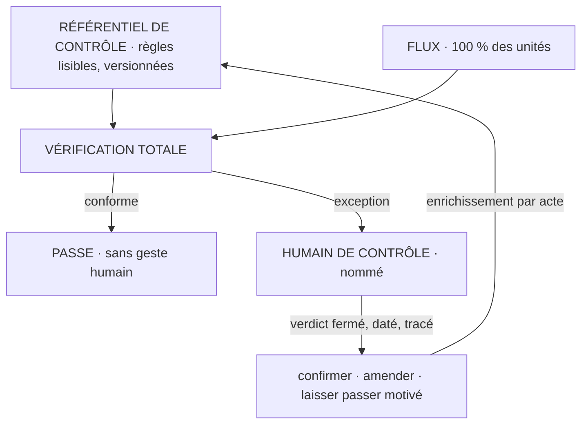
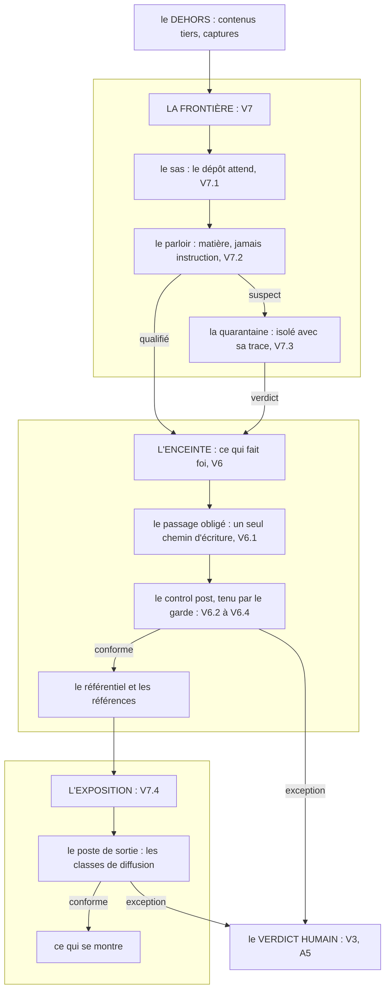

# WHITEPAPER VIGILANCE

`Statut : hypothèse, 0.0.1. Ce papier donne le pourquoi ; le normatif vit
dans la SPEC, qui prime. Le français fait foi.`

## La thèse

Dans un processus de production assisté par IA, l'attention humaine est la ressource rare, et les
deux façons courantes de la dépenser échouent. VIGILANCE soutient qu'un contrôle digne de confiance
tient sur trois ingrédients, et qu'aucun des trois ne suffit sans les deux autres :

1. **des règles explicites du « normal »** : écrites, versionnées, contestables ; des contrôles
   qu'on peut lire, jamais le jugement flou d'un modèle ;
2. **la vérification totale par le système** : chaque unité du flux, chaque fois ; l'IA rend la
   vigilance exhaustive abordable ;
3. **l'humain sur les seules exceptions** : avec l'autorité de trancher, et chaque exception jugée
   peut enrichir les règles.

La maxime tient le tout : l'humain concentré là où il a de la valeur, le système vigilant partout.
Le nom dit la thèse. La psychologie des facteurs humains appelle *vigilance* la surveillance
soutenue d'un flux d'événements rares, et documente depuis Mackworth (1948) que l'humain y décline
en quelques dizaines de minutes. VIGILANCE prend ce constat au mot : la surveillance revient au
système, qui ne décline pas ; le jugement revient à l'humain, qui est le seul à en avoir un.

## Le problème

Deux façons de contrôler le travail, et les deux échouent quand le volume monte. La relecture
humaine exhaustive ne passe pas à l'échelle : au-delà d'un débit, elle fabrique le tampon-buvard,
l'humain qui signe sans voir, et la trace de contrôle devient un mensonge de forme. Le contrôle par
échantillon passe à l'échelle : il laisse passer l'aiguille, l'anomalie rare à conséquence, qui est
précisément ce qu'un contrôle existe pour attraper.

L'IA aggrave le problème et fournit le remède dans le même geste. Elle aggrave : le volume produit
par unité de temps humain monte, donc la part relue par tête baisse. Elle fournit : le coût de la
vérification mécanique d'une unité s'effondre, donc la vérification totale devient abordable là où
elle exigeait hier une armée. Le contrôle par exception est la configuration qui encaisse les deux :
couverture totale, attention humaine réelle. Ni la relecture exhaustive ni l'échantillon n'offrent
cette combinaison.

## Pourquoi des règles lisibles

On pourrait confier le « normal » au jugement d'un modèle : il lirait tout et signalerait ce qui
lui semble étrange. Le gain apparent est l'économie d'écriture ; le coût est fatal : un jugement
qu'on ne peut pas lire ne se conteste pas, ne se versionne pas, et dérive avec chaque génération de
modèle. La règle écrite coûte son écriture et rachète tout le reste : elle se lit, se discute,
s'amende par acte tracé, et deux passages du même flux donnent le même verdict. Le modèle garde un
rôle, en amont : proposer des règles candidates, jamais en être une (spécifié, non éprouvé).

L'occurrence fondatrice l'illustre : au premier passage sur pièce réelle, le contrôle a mis au jour
une règle de prix que le métier appliquait depuis toujours et n'avait jamais écrite (démontré au
terrain, N=1). Une règle implicite découverte en exploitation s'écrit ou se rejette ; elle ne reste
jamais tacite.

## Pourquoi la vérification totale

L'échantillon est né d'une contrainte de coût, pas d'un choix de méthode : quand la relecture coûte
cher, on en achète moins. La contrainte est tombée pour tout contrôle exprimable en règle lisible.
Dès lors, l'échantillon n'est plus une économie, c'est un trou : chaque unité non vérifiée est une
anomalie possible en circulation. La vérification totale a deux disciplines : le système ne corrige
jamais en silence, ce qui sort d'une règle remonte ; et une unité invérifiable est une exception,
pas un passage réussi. Un contrôle qui rectifie tacitement fabrique un flux propre en apparence et
un référentiel qui ment. Et vérifier tout ne veut pas dire surveiller en permanence :
le contrôle a deux régimes, le passage et la ronde, dits au plan de l'architecture.

## Pourquoi l'humain sur les seules exceptions

Concentrer l'humain sur les exceptions n'est pas le réduire : c'est le placer là où son jugement
change quelque chose. Trois disciplines tiennent le poste. L'humain de contrôle est nommé : une
exception sans destinataire n'a pas de circuit de verdict. Le verdict est un acte fermé : confirmer
et faire corriger, amender la règle, ou laisser passer motivé ; toute forme est datée et tracée. Et
le laisser-passer non motivé est la dérive nommée du système, le tampon : il se compte, il ne se
néglige pas. Le contrôle constate et alerte, il n'autorise pas ; l'autorité reste à l'humain, et
aucun réglage ne la déplace, seule l'attention se déplace.

## Pourquoi la boucle

Un référentiel de contrôle figé meurt de deux façons : les règles trop strictes noient l'humain
sous les fausses alertes, les règles trop lâches le rendent décoratif. La boucle est le mécanisme
d'équilibre : chaque verdict peut ouvrir un amendement, les exceptions d'hier deviennent les
contrôles de demain, et le référentiel garde une histoire lisible, chaque règle sachant de quel
verdict ou de quelle source elle vient. La discipline est empruntée à la famille : le volume
propose, l'acte décide. Dix exceptions identiques fondent une proposition, jamais une décision.
C'est un apprentissage organisationnel, pas statistique : ce qui s'accumule est un référentiel
que l'organisation peut lire, pas des poids dont personne ne répond.

## L'architecture, en un schéma

*Lecture du schéma : le système vérifie chaque unité contre des règles lisibles ; le conforme
passe sans geste humain ; l'exception remonte au verdict fermé ; le verdict qui met la règle en
cause amende le référentiel par acte tracé — les exceptions d'hier deviennent les contrôles de
demain.*

Sept familles de règles portent ce schéma : le référentiel de contrôle (V1), la vérification
totale (V2), l'exception et le verdict (V3), l'enrichissement (V4), les mesures de santé (V5),
et le control post (V6) : le même contrôle par exception appliqué au système lui-même, ce qui fait
foi ne s'écrivant que par un chemin unique, sous des gardes déterministes au budget de latence
déclaré. La septième, la frontière avec le dehors (V7) : le sas, le parloir, la quarantaine et
le poste de sortie — un premier terrain côté exposition, l'entrée encore à éprouver, et le rang
de chaque règle dit tel quel.
Trois mesures disent si le montage vit : le taux d'exceptions (trop haut : règles trop strictes ou
processus malade ; zéro prolongé : règles trop lâches ou humain décoratif), le taux de correction
humaine (l'humain tranche-t-il, ou tamponne-t-il ?), et l'enrichissement dans le temps.

Et la place forte entière, V6 et V7 réunies, en un plan :

*Lecture, de haut en bas : le dehors n'atteint l'enceinte que par la frontière ; dedans, rien ne
s'écrit hors du passage obligé et de son control post ; ce qui se montre repasse par le poste de
sortie ; toute exception, d'où qu'elle vienne, remonte au même verdict humain, et l'autorité ne
bouge pas. La ronde (V6.2) veille en asynchrone sans jamais bloquer ; le drill, le banc
adversarial des postes, vit dans research/. Rangs dits tels quels : V6 a son premier terrain,
V7.4 le sien, V7.1 à V7.3 sont spécifiées, non éprouvées.*
Ce plan peut faire croire à une surveillance permanente ; le refus est doctrinal. Le
contrôle vit en deux régimes : le passage (V2, V6 : à chaque unité du flux, déterministe,
borné en latence) et la ronde (périodique, asynchrone, par jugement). Un contrôle permanent
n'ajouterait aucune garantie, puisque rien ne change par le chemin entre deux actes et que
le hors-chemin est une anomalie en soi (V6.1) ; il ajouterait du coût et du bruit, ce que
l'économie de l'attention refuse. La limite se déclare plutôt qu'elle ne se cache : entre
deux rondes, une modification hors chemin reste invisible, et c'est la ronde suivante qui
la constate.

## Le cas fondateur

Le concept est né sur un terrain réel, le contrôle de devis fournisseurs, le 2026-08-06 : une
seconde paire d'yeux humaine remplacée par cinq contrôles mécaniques (référence, désignation,
tarif, prix public, coefficient). Premier passage sur pièce le lendemain : quinze lignes, sept
fournisseurs, neuf exceptions remontées, dont deux références fausses invisibles au prix, qui
auraient livré le produit A à la place du produit B (démontré au terrain, N=1). Le
même passage a mis au jour la règle implicite du métier citée plus haut. Première mesure, le
2026-09-04 : un devis, contrôle inclus, passe de 65-90 minutes à 25 (mesuré chez l'auteur, un
point de donnée, déclaré comme tel). Rien de répliqué : le détail daté vit dans LINEAGE.

## Conditions d'application

Le contrôle par exception s'applique à un flux d'unités comparables dont le « normal » s'exprime
en règles lisibles. Là où le jugement ne se réduit pas à des règles, A2 borne le domaine : le
montage ne s'applique pas, et le domaine se déclare (R2). Il ne s'applique pas non plus à
l'admission au canon au sens de LIVING REFERENCE : valider ce qui fera foi est un acte d'attention
pleine sur chaque candidat, pas un flux à échantillonner en attention. Le cas dégénéré existe et se
dit : un flux de dix unités par mois se relit en entier, le montage n'y rachète rien ; le contrôle
par exception achète son coût fixe, l'écriture et l'entretien du référentiel, par le volume. Ce
coût est le vrai prix du système : des règles que personne n'amende redeviennent un décor.

## Ce qui réfuterait ce papier

Quatre conditions publiées avant toute série, R1 à R4 de la SPEC. La centrale, R1 : si, sur un
processus réel instrumenté, le contrôle par exception laisse passer davantage d'anomalies à
conséquence que la relecture humaine exhaustive qu'il remplace, à temps humain égal ou supérieur,
le concept tombe. R2 tue A2 sur tout domaine dont le normal ne s'écrit pas ; R3 tue la boucle si
l'amendement ne réduit pas la récurrence ; R4 tue l'économie si le taux d'exceptions ne tient dans
aucune bande exploitable. Le protocole du drill, le banc adversarial des postes, est
pré-enregistré dans research/ avant toute mesure. Les résultats, négatifs compris, se publieront.

## Travaux voisins

Le contrôle par exception descend d'une lignée déclarée. Le *management by exception* est un
principe de gestion établi de longue date : ne faire remonter au décideur que les écarts au plan.
La maîtrise statistique des procédés (les cartes de contrôle, depuis Shewhart) fait remonter les
sorties de limites statistiques ; elle échantillonne et infère, là où VIGILANCE écrit des règles et
vérifie tout. La littérature de supervision humaine de l'IA discute l'*exception-based oversight*
et le *human-in-the-loop* ; la recherche du 2026-09-04 n'y a trouvé aucun cadre nommé qui
l'instrumente en doctrine lisible. Et la psychologie de la vigilance fournit l'appui empirique du
partage : l'humain décline en surveillance soutenue, pas en jugement ponctuel. Aucune de ces
sources ne combine les règles lisibles versionnées, la vérification totale rendue abordable par
l'IA, la boucle de verdicts tracés et les mesures de santé publiées en un seul cadre : c'est cet
assemblage, et lui seul, que VIGILANCE revendique.

La frontière (V7) a ses propres voisins, déclarés au même régime : la sûreté et la sécurité des
systèmes pour le sas et la quarantaine, la littérature de l'injection indirecte de prompt pour le
parloir (l'attaque que V7.2 nomme y est décrite), la classification de l'information et le
contrôle des flux de sortie pour le poste de sortie. Là encore, l'apport revendiqué est
l'assemblage sous un même verdict humain, jamais les organes pris un à un. Une limite s'en déduit et se dit sans détour :
VIGILANCE économise l'attention face à la dérive ordinaire, pas face à un adversaire actif.
La sécurité suppose un attaquant qui lit les règles pour les contourner ; une doctrine de
l'attention ne promet rien contre lui, et un déploiement qui affronte cet adversaire
relève des champs cités ici, pas de ce corpus.

## La place dans la famille

LIVING REFERENCE gouverne le statut du savoir ; WORKING REFERENCE, la façon dont la référence sert
le travail ; MYSTANCE, la place de l'humain dans la relation ; SOUNDNESS, la naissance du savoir
extrait de documents. VIGILANCE porte le chaînon entre eux : l'économie de l'attention humaine. Il
consomme les références validées comme matière de ses règles ; il incarne en général le tamis que
SOUNDNESS applique à la curation ; il donne un instrument de mesure au contrôle qui constate et alerte sans
autoriser (M2) de MYSTANCE. Et il ne touche pas au regard humain que SOUNDNESS exige : la vigilance du système
déplace la vérification exhaustive, précisément pour que le regard humain restant soit réel — « la
vigilance ne se délègue pas » reste vrai là où SOUNDNESS le dit.

## Statut, et la mesure à venir

Rang hypothèse : un praticien, un processus instrumenté, une mesure. La première série honnête sera
faite chez l'auteur, déclarée comme telle ; la mesure qui compte viendra d'un déploiement tiers, et
ce corpus ne dira jamais l'avoir avant de l'avoir. Ce qui se mesurera, pré-enregistré avant toute
série : le taux d'exceptions et sa bande, le taux de correction humaine sur les exceptions, la
récurrence des exceptions de même cause après amendement, et le temps humain par livrable contrôlé,
relecture comprise.
