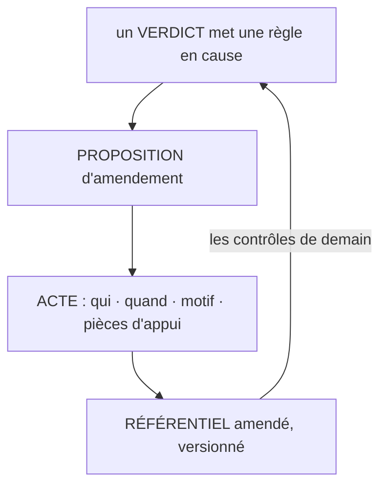

# La boucle d'enrichissement

**Les exceptions d'hier deviennent les contrôles de demain.**

## Ce que c'est

Un référentiel de contrôle figé meurt de deux façons : trop strict, il noie l'humain sous les
fausses alertes ; trop lâche, il le rend décoratif. La boucle est le mécanisme d'équilibre : tout
verdict qui révèle une règle manquante, fausse ou trop stricte ouvre une proposition d'amendement,
et l'amendement est un acte tracé, décidé par un humain habilité, daté, motivé. Le référentiel a
une histoire lisible : chaque règle sait de quel verdict ou de quelle source elle vient, et les
amendements se relisent.

*Lecture : le volume propose (dix exceptions identiques fondent une proposition, jamais une
décision), l'acte décide ; chaque règle sait d'où elle vient.*

C'est un apprentissage organisationnel, pas statistique : ce qui s'accumule est un référentiel que
l'organisation peut lire et contester, pas des poids dont personne ne répond. La discipline est
empruntée à la famille : le volume propose, l'acte décide.

## Le geste

Deux gestes, aux deux bouts. Au verdict : signaler que la règle est en cause, pas seulement
l'unité. À l'acte : amender avec motif et pièces d'appui, comme toute validation. La rétrogradation
suit le même chemin : une règle contredite par le terrain s'amende ou se retire par acte, jamais
silencieusement.

## Un exemple

La règle du coefficient d'usage (prix de vente = prix public × un coefficient constant)
n'existait dans aucun document : le métier l'appliquait, le
contrôle a signalé des écarts inexpliqués, le verdict a reconnu la règle implicite, l'acte l'a
écrite. Depuis, elle vérifie chaque ligne de chaque devis : une exception d'un jour est devenue un
contrôle permanent, et le référentiel garde la trace de sa naissance.

La boucle en une exception : « cet écart revient sur chaque devis du fournisseur F » ; l'acte
donne à F sa bande propre ; dès le lendemain, l'écart normal passe et le vrai écart remonte.

## Les règles qui s'appliquent

A4 ; V4 entière (V4.1 à V4.3) ; V1.3 pour la règle implicite.

## Ce que cette fiche ne promet pas

La boucle n'entraîne aucun modèle et ne promet aucune convergence automatique : si l'amendement ne
réduit pas la récurrence des exceptions de même cause sur la durée du profil, R3 réfute la boucle,
et le corpus le dira.

## Rang de preuve

**Hypothèse.** Une occurrence de terrain, N=1, déclarée (la règle implicite écrite) ; aucun banc,
aucun déploiement tiers.
