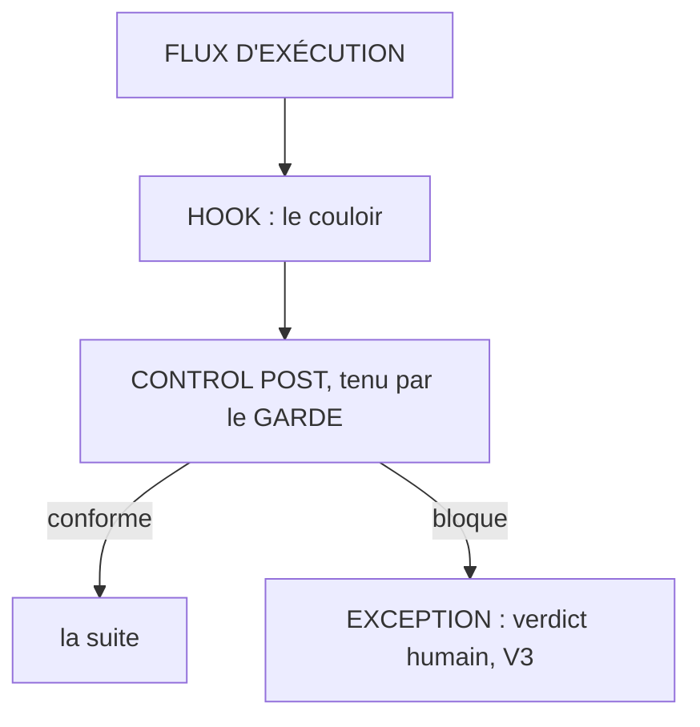

# Le control post

**Ce qui fait foi ne s'écrit que par une porte, et la porte a un garde.**

## Ce que c'est

Le contrôle par exception appliqué au système lui-même. Les références qui font foi, la base de
connaissance en tête, sont un flux d'écritures comme un autre : le pire scénario d'un système
assisté par IA est la corruption silencieuse de ce qui fait foi, par erreur de bonne foi ou par
contenu malveillant. Le control post est la réponse : un seul chemin d'écriture, des gardes
déterministes, et l'exception qui remonte. Trois mots que la pratique confond, et qu'il faut
séparer :

| Mot | Ce que c'est |
|---|---|
| le **hook** | le couloir : l'emplacement dans le flux d'exécution (avant un outil, après une écriture) où l'on branche du code ; neutre, il peut porter un capteur ou un contrôle |
| le **control post** | la fonction de contrôle (en français : le poste de contrôle) : un critère, un verdict (passe · bloque · exception) ; il existe sans code, une fenêtre d'arbitrage humaine est un control post sans hook. Le mot *gate* reste à WORKING REFERENCE : là-bas, l'épreuve datée d'admission ; ce corpus ne le possède pas |
| le **garde** | le script déterministe qui tient le poste : un registre, une liste, une comparaison ; des millisecondes |

*Lecture : préventif, le poste bloque avant le geste ; détectif, le geste a lieu et l'agent est
bloqué puis corrige (le sol versionné le permet).*

## Le geste

Déclarer le chemin d'écriture unique vers ce qui fait foi, et sceller le control post dessus. Le garde
est un script, jamais un modèle : le jugement agentique (lint, revue périodique) reste asynchrone,
la ronde, jamais le control post. Le budget de latence appartient au profil (défaut : une
seconde) ; un garde qui le dépasse devient asynchrone, ou il saute.

## Un exemple

Le cas fondateur du concept : le contrôle des devis fournisseurs. Avant, la sécurité était des
passes humaines : saisie relue, prix recontrôlés, cohérence revérifiée, trois passages de tête sur
chaque devis, le contrôle exhaustif qui fabrique le tampon quand le volume monte. Le control post posé
le 2026-08-06 : aucun devis n'engage quoi que ce soit sans passer cinq gardes déterministes
(référence, désignation, tarif, prix public, coefficient) ; conforme passe, exception remonte.
Premier passage sur pièce réelle : quinze lignes, sept fournisseurs, neuf exceptions remontées,
dont deux références fausses invisibles au prix, qui auraient livré le produit A à la
place du produit B. La tête a jugé neuf exceptions au lieu de relire trois fois quinze lignes, et
c'est là qu'elle a de la valeur : trancher un vrai doute de métier, pas recompter des lignes.

## Les règles qui s'appliquent

V6 entière (V6.1 à V6.4) ; V3 pour le circuit d'exception ; V1.4 pour le garde qui n'est jamais un
modèle ; A5 pour l'autorité qui ne bouge pas.

## Ce que cette fiche ne promet pas

Pas l'inviolabilité. La doctrine n'est pas l'inviolabilité : rendre l'attaque aussi
improbable qu'un astéroïde, et survivable si elle arrive : toute écriture laisse une trace et se
défait. La survivabilité elle-même, le sol versionné et le journal qui ne se réécrit pas,
appartient à l'environnement, hors de ce corpus. Et le vecteur réel n'est pas la porte : c'est le
garde, un contenu faux ou malveillant ingéré par le pipeline légitime, qui fait écrire l'agent de
bonne foi. Qualifier ce qui entre reste normé par SOUNDNESS (S5) ; la frontière elle-même vit en V7
(fiche LA-FRONTIERE).

## Rang de preuve

**Hypothèse.** Un terrain, N=1, depuis le 2026-08-06 ; aucun banc, aucun déploiement tiers. Les
effets attendus se disent au conditionnel.
