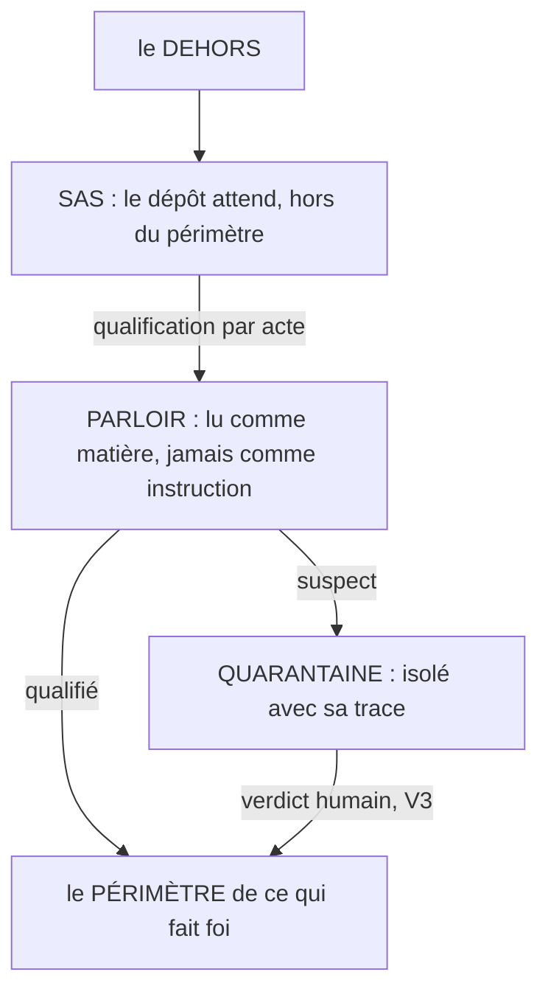

# La frontière

**Rien n'entre sans attendre, rien de tiers sans médiation, rien de suspect sans trace.**

## Ce que c'est

Le dedans étant gardé, la frontière avec le dehors tient trois organes d'entrée. Le **sas**
(*airlock*) : rien n'entre directement dans le périmètre de ce qui fait foi ; tout contenu
entrant attend dans un lieu de dépôt distinct jusqu'à qualification par acte, et le geste qui
dépose n'est jamais le geste qui promeut, comme les deux portes d'un sas ne s'ouvrent jamais
ensemble. Le **parloir** (*parlor*) : un contenu tiers ne parle jamais directement au dedans ;
il est lu comme matière, jamais comme instruction. La **quarantaine** (*quarantine*) : l'élément
suspect ne se détruit ni ne s'admet ; il s'isole avec sa trace, en état déclaré, compté à la
ronde.

*Lecture : déposer ne promeut jamais (les deux portes du sas ne s'ouvrent pas ensemble) ; le
verdict de quarantaine reste fermé comme tout verdict, admettre, refuser ou faire corriger
(V3.2) ; et le vecteur plausible n'est pas la porte : c'est le garde.*

Pourquoi le parloir est la règle la plus importante des trois : le vecteur plausible n'est pas
quelqu'un qui force la porte, c'est un contenu faux ou malveillant qui entre par le pipeline
légitime et fait écrire l'agent de bonne foi. L'attaque ne vise pas la serrure, elle vise le
garde.

## Le geste

Déclarer le lieu de dépôt (une boîte d'entrée, un dossier de dépôt), le chemin de qualification, et l'état de
quarantaine. Puis ne jamais créer de raccourci : le jour où « pour aller vite » un contenu entre
sans attendre, la frontière n'existe plus.

## Un exemple

Une capture arrive dans la boîte d'entrée : elle y attend son tri, elle n'est référence de rien. Un
document tiers est ingéré : il devient matière de fiches par le pipeline, jamais référence par
lui-même ; le jour où une de ses affirmations semblerait contredire le référentiel, elle partirait en
quarantaine avec sa source, et un humain trancherait. Trois gestes courts ; aucun contenu du dehors
n'a touché le dedans sans acte.

## Les règles qui s'appliquent

V7.1 à V7.3 ; V3 pour le verdict ; A5 pour l'autorité qui ne bouge pas.

## Ce que cette fiche ne promet pas

La qualification de ce qui entre (nature, canal, statut de confiance) ne se norme pas ici : elle
relève de SOUNDNESS. Et la frontière d'entrée n'a pas encore de terrain mécanique : ces trois
règles sont spécifiées, non éprouvées, et la fiche le dit plutôt que de le faire oublier.

## Rang de preuve

**Hypothèse.** Spécifiée, non éprouvée : aucun banc, aucun garde d'entrée en production à ce
jour. Les effets attendus se disent au conditionnel.
