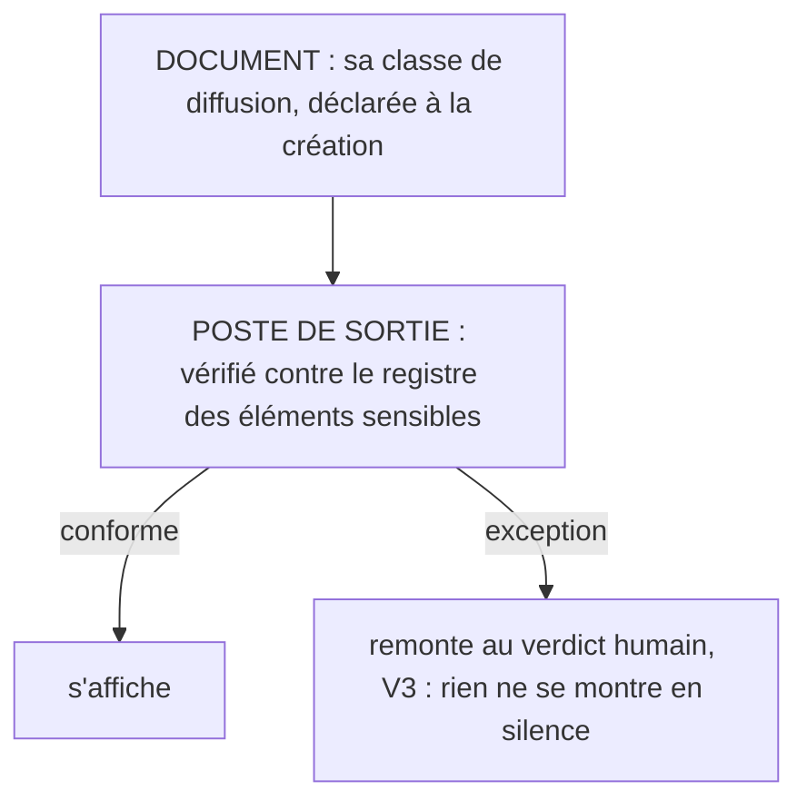

# Le poste de sortie

**Ce qui se montre se contrôle comme ce qui s'écrit.**

## Ce que c'est

Un flux sort aussi de l'enceinte : ce qui s'affiche en démo, se partage à l'écran, part chez un
tiers. Le poste de sortie (*exit post*) est le control post de ce flux d'exposition : tout
document destiné à être montré porte une classe de diffusion déclarée, et un garde
vérifie qu'aucun élément d'une classe plus fermée n'y figure. Les classes et leurs noms sont
délégués au profil d'application ; le verdict d'exception reste humain.

*Lecture : la classe dit l'intention, le poste de sortie la fait tenir.*

Une règle de diffusion sans garde est un vœu : la classe déclarée dit l'intention, le poste de
sortie la fait tenir. C'est le frère du contrôle d'écriture : l'un vérifie ce qui entre au
référentiel, l'autre ce qui sort vers des yeux.

## Le geste

Poser la classe à la création du document, en une ligne de bandeau : le coût est nul. La version
montrable ne se crée que sur événement réel (une démo planifiée), et c'est une distillation,
plusieurs fois plus courte que l'original : le geste inverse du doublement.

## Un exemple

Un dossier de préparation nomme un compte visé : classe fermée, il ne s'affichera jamais. La
démo approche : une page montrable est distillée, sans un nom sensible. Le jour où le garde
existera, il relira la page contre le registre des noms : une ligne oubliée qui citerait le
compte remonterait, l'humain la retirerait, la démo partirait propre. Le regard par-dessus
l'épaule ne trouverait rien : il n'y aurait rien.

## Les règles qui s'appliquent

V7.4 ; V3 pour le verdict ; V1 pour le registre des éléments sensibles ; A5.

## Ce que cette fiche ne promet pas

Le poste ne juge pas la sensibilité : c'est l'humain qui déclare les classes et le registre, et
une classe mal posée passe le garde. Et rien n'abolit le risque d'exposition, une photo d'écran
reste possible : le poste le réduit à ce que la discipline peut atteindre, il ne promet pas
l'invisible.

## Rang de preuve

**Hypothèse.** Un premier terrain : la règle des classes opère depuis le 2026-09-05 sur un poste
de travail réel (premier couple document interne / version montrable) ; le garde mécanique de sortie reste à
construire. Aucun banc, aucun déploiement tiers.
