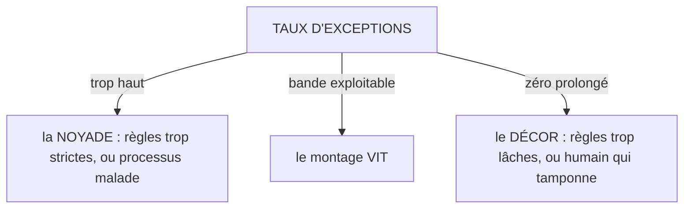

# Les mesures de santé

**Un taux d'exceptions ne se célèbre jamais : il se lit.**

## Ce que c'est

Trois mesures disent si le montage vit, et chacune a une lecture double. Le **taux d'exceptions** :
trop haut, les règles sont trop strictes ou le processus est malade ; zéro prolongé, les règles
sont trop lâches ou l'humain est décoratif ; les deux lectures se traitent, aucune ne se célèbre.
Le **taux de correction humaine** sur les exceptions : l'humain tranche-t-il, ou tamponne-t-il ?
Les laisser-passer non motivés s'y comptent à part. L'**enrichissement dans le temps** : la part du
référentiel née de verdicts, et la récurrence des exceptions de même cause après amendement.

*Lecture : les deux autres mesures complètent la vue. Le taux de correction : l'humain
tranche-t-il ? Et l'enrichissement : la règle morte est celle que plus aucun verdict n'amende.*

Les seuils d'alerte sont délégués au profil d'application. Sans profil, les mesures se publient
sans seuil : l'absence de profil n'est jamais un vide, c'est le défaut.

## Le geste

Publier les mesures au rythme du profil, et les lire comme des symptômes, jamais comme des scores.
Un taux qui bouge pose une question au référentiel ou au processus ; il ne récompense ni ne punit
personne, et surtout pas l'humain de contrôle.

## Un exemple

La première mesure du terrain fondateur : un devis, contrôle inclus, passe de 65-90 minutes à 25.
C'est un point de donnée, mesuré chez l'auteur, déclaré comme tel ; il dit que l'économie est
plausible, pas qu'elle est acquise. Ce que la série devra publier, pré-enregistré avant toute
mesure : le taux d'exceptions et sa bande, le taux de correction, la récurrence après amendement,
et le temps humain par livrable contrôlé,
relecture comprise.

Ce qu'une série donnerait à lire, en trois chiffres : 4 % d'exceptions, deux tiers tranchées en
correction, trois règles amendées. Et un mois à zéro exception trois semaines de suite ne serait
pas une victoire : ce serait une alerte (V5.1).

## Les règles qui s'appliquent

V5 entière (V5.1 à V5.4) ; R4 pour la bande exploitable.

## Ce que cette fiche ne promet pas

Une mesure à N=1 ne prouve rien : elle déclare. Les seuils appartiennent au profil, pas à la
doctrine, et aucune bande « saine » universelle n'est revendiquée : chaque processus gagne la
sienne par l'usage tracé.

## Rang de preuve

**Hypothèse.** Une mesure unique, chez l'auteur, déclarée ; aucune série, aucun déploiement tiers.
