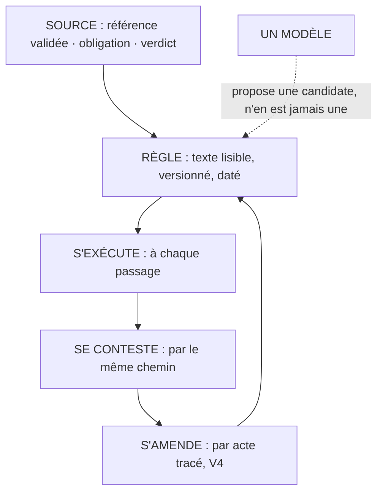

# Les règles lisibles

**Une règle qu'on ne peut pas lire n'est pas une règle de contrôle.**

## Ce que c'est

Le « normal » d'un flux se définit par un référentiel de contrôle : des règles écrites,
versionnées, datées, contestables par le même chemin qu'elles s'écrivent. Chaque règle porte son
motif et sa source : une référence validée, une obligation déclarée, ou le verdict qui l'a fait
naître. Le jugement d'un modèle peut proposer une règle candidate ; il n'en est jamais une : ce que
le système exécute au contrôle est le texte de la règle, pas une appréciation.

*Lecture : une règle naît d'une source, s'exécute, se conteste et s'amende par acte ; le modèle
propose, il n'est jamais la règle.*

Pourquoi cette exigence coûteuse ? Un jugement qu'on ne peut pas lire ne se conteste pas, ne se
versionne pas, et dérive avec chaque génération de modèle. La règle écrite coûte son écriture et
rachète tout : deux passages du même flux donnent le même verdict, et le désaccord a un texte
à attaquer.

Une règle tient en une ligne. « Tout prix de vente vaut le prix public multiplié par le
coefficient déclaré ; hors bande, exception. » Lisible, contestable, exécutable : les trois
propriétés tiennent dans la phrase.

## Le geste

Écrire la règle avec son motif et sa source. Et quand l'exploitation révèle une règle implicite,
un usage que le métier applique sans l'avoir jamais écrit, elle s'écrit ou se rejette, par
verdict : elle ne reste jamais tacite.

## Un exemple

Au premier passage du contrôle sur une pièce réelle, une règle de prix est apparue : le métier
pratiquait « prix de vente = prix public × un coefficient d'usage » depuis toujours, sans l'avoir écrite nulle part.
Le contrôle l'a mise au jour en signalant des écarts que rien n'expliquait ; elle est devenue une
règle écrite, avec sa source. Un référentiel de contrôle est aussi cela : le lieu où le savoir
implicite d'un métier devient contestable.

## Les règles qui s'appliquent

A2 ; V1 entière (V1.1 à V1.4).

## Ce que cette fiche ne promet pas

Personne n'écrit les règles à votre place, et tout domaine ne s'écrit pas : là où le « normal »
exige durablement un jugement qui ne se réduit pas à une règle lisible, le montage ne s'applique
pas, et le domaine se déclare (R2). Prétendre le contraire tuerait la confiance que la lisibilité
achète.

## Rang de preuve

**Hypothèse.** Une occurrence de terrain, N=1, déclarée ; aucun banc, aucun déploiement tiers. Les
effets attendus se disent au conditionnel tant qu'ils ne sont pas mesurés.
