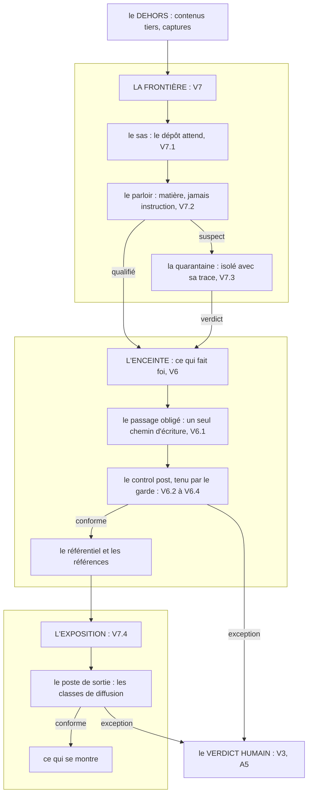

# Le stronghold

**La place forte : chaque organe garde un flux, et toute exception remonte au même verdict humain.**

## Ce que c'est

Le nom d'ensemble de l'image doctrinale (*stronghold*, en français : la place forte) : V6 tient
le dedans (rien ne s'écrit dans ce qui fait foi hors du passage obligé et de son control post)
et V7 tient la frontière avec le dehors : ce qui entre attend au sas, ce qui est tiers passe au
parloir, ce qui est suspect s'isole en quarantaine, ce qui se montre repasse par le poste de
sortie. La doctrine de l'ensemble n'est pas l'inviolabilité : c'est rendre l'attaque aussi
improbable qu'un astéroïde, et survivable si elle arrive.

*Lecture, de haut en bas : le dehors n'atteint l'enceinte que par la frontière ; dedans, rien ne
s'écrit hors du passage obligé ; ce qui se montre repasse par le poste de sortie ; toute
exception converge vers le même verdict humain, et l'autorité ne bouge pas.*

## Le geste

On ne bâtit pas la forteresse d'un coup. Déclarer d'abord le périmètre : ce qui, dans ce
déploiement, fait foi. Poser ensuite le passage obligé et son premier control post (V6), parce
que le dedans se garde avant la frontière. Ouvrir V7 organe par organe, chacun quand son flux
existe et sur un besoin vécu : un sas quand du contenu entre, un poste de sortie quand quelque
chose se montre. Un organe posé sans flux à garder est un décor.

## Un exemple

Un poste de travail réel : le périmètre est sa base de savoir ; le premier poste contrôle les
faits qui s'écrivent dans les livrables ; la règle des classes de diffusion arme son poste de
sortie le jour où une démo approche ; la ronde est sa revue périodique. Trois organes, posés en
trois jours, chacun né d'un incident vécu — jamais d'un plan d'architecte.

## Les règles qui s'appliquent

V6 et V7 entières ; V3 et A5 pour le verdict unique ; V1 pour les registres que les gardes
exécutent.

## Ce que cette fiche ne promet pas

Pas l'inviolabilité : l'astéroïde reste possible, la doctrine le dit d'avance. La survivabilité
(le sol versionné, le journal qui ne se réécrit pas) appartient à l'environnement, hors de ce
corpus. Et l'exploitation de la place forte — la ronde au quotidien, le drill qui éprouve les
postes, l'inventaire — ne se norme pas ici : la ronde vit en V6.2, le drill dans research/, le
reste dans les profils.

## Rang de preuve

**Hypothèse.** L'ensemble n'a jamais été opéré complet : V6 a un terrain, V7.4 un autre, V7.1 à
V7.3 sont spécifiées, non éprouvées. Cette fiche cartographie ; elle ne prouve rien.
