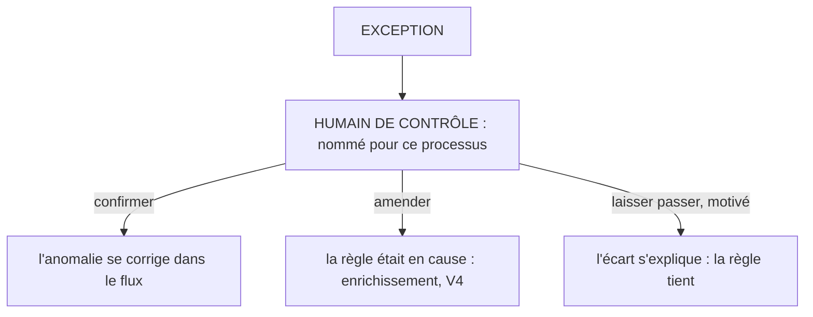

# Le verdict d'exception

**Le contrôle constate et alerte ; l'humain tranche.**

## Ce que c'est

Toute exception remonte à un humain de contrôle nommé, avec la règle sortie, la valeur constatée
et le contexte nécessaire au verdict. Le verdict est un acte fermé : confirmer l'anomalie et la
faire corriger ; corriger la règle, en ouvrant un enrichissement ; ou laisser passer, motivé.
Toute forme est datée et tracée. Une exception sans destinataire nommé n'a pas de circuit de
verdict : le processus n'est pas sous contrôle par exception, quoi qu'en dise son outillage.

*Lecture : trois verdicts fermés, datés, tracés. Un laisser-passer non motivé n'est pas un
verdict : c'est le tampon, et il se compte (V5.2).*

L'autorité ne bouge pas : le contrôle constate et alerte, il n'autorise pas. Aucun réglage ne
déplace le verdict vers la machine ; seule l'attention se déplace.

## Le geste

Trancher, et le dire : le verdict le plus court est légitime s'il est motivé. Le laisser-passer
non motivé est la dérive nommée du système, le tampon : il se compte à part dans les mesures de
santé, il ne se néglige pas et ne se cache pas.

## Un exemple

Sur les neuf exceptions du premier passage, le verdict a séparé trois familles : les erreurs
confirmées à faire corriger (dont les deux références fausses), les écarts qui révélaient une
règle manquante (devenue règle écrite), et les écarts explicables, laissés passer avec leur motif.
Trois gestes courts ; aucun n'a demandé de relire les lignes conformes.

Trois verdicts d'une matinée, une ligne chacun : « référence fausse, corriger » · « la bande de
prix était trop étroite, amender » · « écart connu, explication au dossier, passe ».

## Les règles qui s'appliquent

A5 ; V3 entière (V3.1 à V3.4).

## Ce que cette fiche ne promet pas

Le circuit de verdict ne remplace pas la relation réglée : quand l'humain tamponne, le versant
relation relève de MYSTANCE ; VIGILANCE dit comment le flux le rend visible, par un taux. La
fiche donne l'instrument de mesure, pas la garantie que l'humain regarde.

## Rang de preuve

**Hypothèse.** Une occurrence de terrain, N=1, déclarée ; aucun banc, aucun déploiement tiers.
