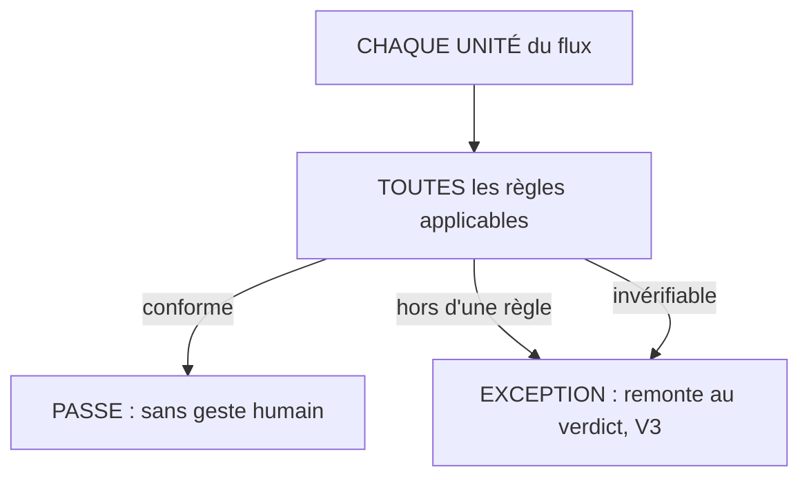

# La vérification totale

**L'échantillon n'est pas une économie, c'est un trou.**

## Ce que c'est

Le système vérifie 100 % du flux contre toutes les règles applicables, à chaque passage. Il
n'existe pas de mode « échantillon » conforme : l'échantillon est né d'une contrainte de coût,
quand la relecture humaine coûtait cher on en achetait moins, et cette contrainte est tombée pour
tout contrôle exprimable en règle lisible. Chaque unité non vérifiée est une anomalie possible en
circulation.

*Lecture : il n'existe pas de troisième chemin. Jamais de correction silencieuse, et
l'invérifiable n'a pas le bénéfice du doute.*

Deux disciplines tiennent la promesse. Le système ne corrige jamais en silence : ce qui sort d'une
règle remonte, toujours. Un contrôle qui rectifie tacitement fabrique un flux propre en apparence
et un référentiel qui ment. Et une unité qui ne peut pas être vérifiée, donnée manquante, règle
inapplicable, est une exception, pas un passage réussi : l'invérifiable ne bénéficie jamais du
doute.

## Le geste

Aucun, et c'est le point : la vérification totale est le poste de la machine. Le geste humain
commence à l'exception (voir [VERDICT-D-EXCEPTION](VERDICT-D-EXCEPTION.md)).

## Un exemple

Premier passage sur pièce réelle : un devis de quinze lignes, sept fournisseurs, chaque ligne
passée par les cinq contrôles. Neuf exceptions remontées, dont deux références fausses invisibles
au prix : commandé tel quel, le devis
livrait le produit A à la place du produit B.
Une relecture humaine au prix les aurait manquées ; un échantillon aussi, sauf chance. La
couverture totale est ce qui attrape l'aiguille.

Et l'économie tiendrait dans le compte : sur cent lignes, quatre-vingt-dix-sept passeraient sans
un regard, trois remonteraient. Le premier terrain, lui, en a fait remonter neuf sur quinze : un
référentiel jeune remonte beaucoup, et c'est attendu.

## Les règles qui s'appliquent

A3 ; V2 entière (V2.1 à V2.3).

## Ce que cette fiche ne promet pas

La vérification totale ne vaut que ce que vaut le référentiel : elle ne détecte pas ce qu'aucune
règle ne décrit. C'est la boucle d'enrichissement qui répare cette limite dans le temps, jamais la
couverture seule.

## Rang de preuve

**Hypothèse.** Une occurrence de terrain, N=1, déclarée (les neuf exceptions du 2026-08-07) ; aucun
banc, aucun déploiement tiers.
